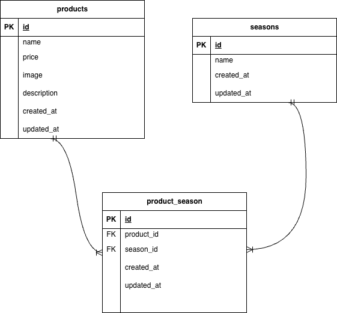

🌱 mogitate

季節ごとの旬の果物を管理する Laravel制作アプリ です。
商品（Product）と季節（Season）は 多対多（ManyToMany） で紐づけられ、

商品登録、編集、削除、検索、並び替え、詳細表示といった
Webアプリ開発の基礎を一通り学べる構成になっています

🚀 **使用技術**

| Category | Tech |
|---------|------|
| 言語 | PHP 8.x |
| FW | Laravel 10.x |
| DB | MySQL 8.x |
| 開発環境 | Docker / docker-compose |
| エディタ | VSCode |

📌 主な機能一覧

###✔ 商品（products）
-	新規登録（画像アップロード対応）
-	編集（画像差し替えも可能）
-	削除
-	一覧表示（グリッドUI）
-	詳細表示（カードクリックで遷移）
-	検索機能（曖昧検索）
-	並び替え（価格昇順/降順）
-	ページネーション対応

###✔ 季節（seasons）
-	季節の登録（Seederで初期データ作成）
-	商品との関連付け（多対多）


###✔ 商品 × 季節（多対多）
-	中間テーブル（product_season）による紐づけ
-	belongsToMany によるリレーション実装済み
-	商品から季節、季節から商品を取得可能

🗂 ER図

プロジェクトのテーブル構造は以下の通りです👇


📁 フォルダ構成（主要部分のみ）
```
mogitate/
├── app/
│   ├── Http/
│   ├── Models/
│   └── Requests/ProductRequest.php
├── database/
│   ├── migrations/
│   └── seeders/
├── public/
│   └── images/
│       └── er_mogitate.jpeg
├── resources/
│   └── views/
│       └── products/
├── routes/
│   └── web.php
├── docker-compose.yml
├── composer.json
└── README.md
```

⚙️ 環境構築手順

#### 1.リポジトリをクローン
- git clone <your repository url>
- cd mogitate

#### 2.Composer パッケージをインストール
- composer install

#### 3. .env 作成
- cp .env.example .env

#### 4.アプリケーションキー生成
- php artisan key:generate

#### 5.Docker 起動
- docker-compose up -d

#### 6.マイグレーション実行
- php artisan migrate

▶️ 起動方法
Docker を使用しているため、以下のコマンドでアプリケーションを起動できます。
#### Docker の起動
docker-compose up -d

起動後、以下の URL にアクセスすることでアプリを利用できます。
👉 http://localhost/products
　　　-（環境によっては http://localhost:8080/products ）

停止するときは次のコマンドを使用します。
docker-compose down

📌 今回の課題で意識した点
- 	ER 図とテーブル仕様書を正確に一致させるよう設計
-	多対多（ManyToMany）の理解・中間テーブル実装
-	belongsToMany のリレーション理解と活用
-	FormRequest によるバリデーション管理
-	UI の統一感・可読性を意識したコーディング

⸻

💬 今後の改善予定
-	季節別の一覧ページ
-	管理画面 UI の更なる改善
-	バリデーションメッセージの強化
-	レスポンシブ対応
-	画像アップロードのセキュリティ改善（storage階層構造など）

💻 作者

小牧智沙都
